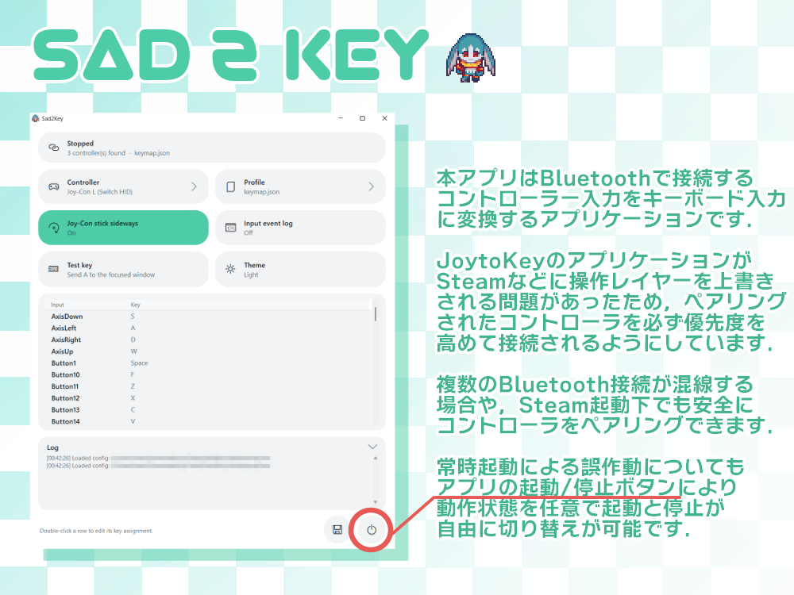

# Sad2Key
<!-- .NET 8 / Windows x64 -->





## 概要

Sad2Key is a lightweight Windows tool that turns Nintendo Switch controller input into keyboard input.  
Bluetooth接続した Nintendo Switch Pro Controller / Joy-Con のボタンやスティックをキーボード入力へ変換します.
本アプリケーションは JoyToKey で発生していた接続の不安定さや入力変換の不具合を回避するために作成されました.
Switch系コントローラーを HID で直接読み取る経路を持ち,JoyToKey形式の `.cfg` プロファイルをそのまま読み込み・編集・保存できます.

## ダウンロード

<a href="https://github.com/Sadc2h4/Sad2Key/releases/tag/v1.0">
  
</a>

## Features / 主な機能

| Feature | Description |
|--------|-------------|
| Switch HID 直接読み取り / Switch HID | Pro Controller, Joy-Con L, Joy-Con R を `hidapi` で直接読み取ります. Bluetooth接続時の遅延と取りこぼしを抑えます. |
| JoyToKey形式プロファイル / JoyToKey .cfg | JoyToKey の `.cfg` を読み込み,編集して保存できます. 未対応の行は原文のまま保持するため,既存の cfg を壊しません. |
| 同時押し / Simultaneous press | 最大4キーの同時押しに対応します. `Ctrl+Z` と `Ctrl+-` のように修飾キーを共有する入力を同時に押しても,最後の1つを離すまで `Ctrl` は押されたままになります. |
| 短押し・長押し / Short & Long press | 押した長さで割り当てを切り替えます (JoyToKey の種別7・モード3に相当). しきい値未満で短押しキー,到達で長押しキーを保持し,離した後のキーも指定できます. |
| マッピング編集 / Mapping editor | 一覧の行をダブルクリックして編集します. 入力欄をクリックしてキーを押すだけで取り込めます. |
| Joy-Con 横持ち / Sideways stick | Joy-Con 単体使用時のスティック方向を横持ち基準に回転します. ON/OFF をタイルで切替できます. |
| 入力の確認 / Input monitor | 押されている入力の行がアクセント色で光ります. 割り当てのない入力も名前を確認できます. |
| テーマ / Theme | Dark / Light をタイルで切替できます. タイトルバーとスクロールバーも追従します. |
| ポータブル / Portable | 設定 (`settings.json` / `keymap.json`) は exe と同じフォルダに保存します. レジストリや `%APPDATA%` は使いません. |

## Latest Changes / v1.0

- 初回リリースです.
- Nintendo Switch Pro Controller / Joy-Con L / Joy-Con R を HID で直接読み取る経路を実装しました.
- JoyToKey形式 `.cfg` の読み込み・新規作成・保存に対応しました. 種別1 (同時押し) と種別7・モード3 (短押し／長押し) を解釈します.
- 修飾キーを共有する同時押しで,途中で修飾キーが離れてしまう問題を解消しました.
- タイル型の UI と Dark / Light テーマを実装しました.
- .NET ランタイム同梱の単一 exe として配布します. インストール不要です.

## Setup

特別なインストールは不要です.  
Place `Sad2Key.exe` in any folder and run it.

```text
Sad2Key.exe
```

初回起動時に `settings.json` と `keymap.json` が exe と同じフォルダに作成されます.  
JoyToKey の `.cfg` を使う場合は,同じフォルダに置くか `Profile > Change folder...` でフォルダを指定してください.

## Usage / 使い方

1. コントローラーを Bluetooth で Windows に接続します. Pro Controller, Joy-Con L, Joy-Con R に対応しています.
2. `Sad2Key.exe` を起動します. Switch HID のコントローラーが見つかると自動で選択されます. 見つからないときは `Controller` タイルから選び直します (`Refresh controllers` で再検出).
3. `Profile` タイルからプロファイルを選びます. JoyToKey の `.cfg` か `keymap.json` を選択できます. 別フォルダの cfg を使うときは `Change folder...` を選びます.
4. 割り当てを変えるときは一覧の行をダブルクリックします. `Hold (while pressed)` か `Short / Long press` を選び,入力欄をクリックしてキーを押すと取り込まれます. `Ctrl` / `Shift` / `Alt` との組み合わせも可能です (最大4キー).
5. 右下の `Save` ボタン (または `Profile > Save profile`) で保存します.
6. 右下の電源ボタンで開始します. 状態ピルが `Running` になります.
7. ゲームやお絵かきソフトなど入力先のウィンドウへフォーカスを移して使います.
8. 止めるときはもう一度電源ボタンを押します. 押下中のキーはすべて解放されます.

## Controller Notes

- 実行中は `Controller` / `Profile` タイルと `Save` ボタン,一覧の編集が無効になります. 送信した矢印キーや Enter で Sad2Key 自身が誤操作されるのを防ぐためです.
- `Controller` の選択肢は `〜 (Switch HID)` の個別コントローラーを推奨します. `All detected controllers` は複数経路を同時に見るため,遅延や重複入力の原因になることがあります.
- `Input event log` は必要なときだけ ON にしてください. OFF の方が入力遅延が小さくなります.
- Joy-Con 単体で縦持ちにしたときスティック方向が合わない場合は,`Joy-Con stick sideways` を OFF にしてください.
- ボタン番号は Bluetooth 接続時に JoyToKey (DirectInput) が見る番号に合わせています. Joy-Con L は 十字左=01, 下=02, 上=03, 右=04, SL=05, SR=06, −=09, スティック押し込み=11, キャプチャ=14, L=15, ZL=16 です.

## Supported .cfg Lines / 対応している cfg の行

| Type | Example | Behavior |
|------|---------|----------|
| 種別1 (同時押し) | `Button01=1, 11:5A:00:00, ...` | 押している間 K1→K4 の順に Down,離すと逆順に Up |
| 種別7 モード3 (短押し／長押し) | `Button03=7, 3, 500, 入力1, 入力2, 入力3, ...` | しきい値未満で入力1をタップ. 到達で入力2を保持し,離すと入力3をタップ |
| それ以外 (マウス割り当てなど) | - | 動作しません. 保存時は原文のまま書き戻します |

連射,マウス操作,アプリ別の自動切替には対応していません.

## Deletion Method / 削除方法

`Sad2Key.exe` が入ったフォルダごと削除してください.  
初回起動時に `%LOCALAPPDATA%\Sad2Key\native\hidapi.dll` が展開されるので,完全に消す場合はこのフォルダも削除してください.  
No registry entries are created by this application.

## Credits

Sad2Key is created by `C2H4`.  
Switch controller HID handling was implemented with reference to [BetterJoy](https://github.com/Davidobot/BetterJoy) (MIT License).  
`hidapi.dll` is from the [hidapi](https://github.com/libusb/hidapi) project.

## Disclaimer / 免責事項

本ソフトウェアの使用によって生じたいかなる損害についても,作者は一切の責任を負いません.  
I assume no responsibility whatsoever for any damages incurred through the use of this software.
